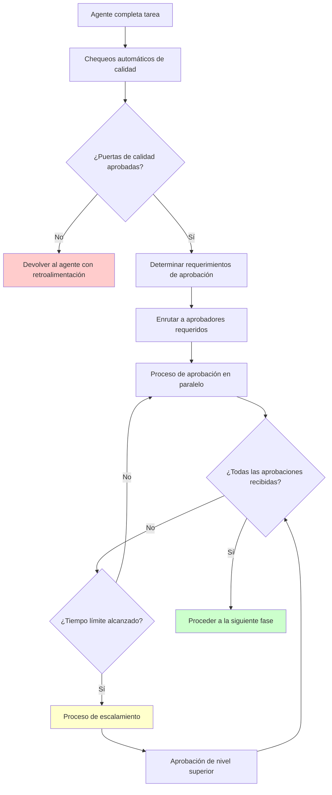

# Marco de Gobernanza y Cumplimiento de IA Responsable

## Descripción general

El marco de Desarrollo de Software de IA con Gobernanza Humana (Manual de Desarrollo de IA Gobernado por Humanos) implementa un modelo de gobernanza integral que equilibra la automatización de IA con la supervisión humana, asegurando calidad, cumplimiento y alineación con el negocio a lo largo del ciclo de vida del desarrollo de software.

---

## Plantilla Universal de Configuración

### Configuración Completa de Gobernanza: `.sdc/config.yaml`

```yaml
# Plantilla Universal de Configuración del Manual de Desarrollo de IA Gobernado por Humanos
project:
  name: "myapp"
  version: "1.0.0"
  organization: "myorg"
  team: "platform-team"
  criticality: "high"              # bajo, medio, alto, crítico
  compliance_requirements: ["gdpr", "sox", "hipaa"]
  
# =============================================================================
# CONFIGURACIÓN DE GOBERNANZA
# =============================================================================
governance:
  # Modelo de supervisión humana
  oversight_model: "hybrid"         # autónomo, híbrido, supervisado
  
  # Matriz de aprobación basada en impacto y criticidad
  approval_matrix:
    # Aprobaciones por impacto de negocio
    business_impact:
      low:
        approvers: ["product_manager"]
        required_approvals: 1
        timeout: "24h"
      medium:
        approvers: ["product_manager", "business_owner"]
        required_approvals: 2
        timeout: "48h"
      high:
        approvers: ["product_manager", "business_owner", "executive_sponsor"]
        required_approvals: 2
        timeout: "72h"
      critical:
        approvers: ["product_manager", "business_owner", "executive_sponsor", "ceo"]
        required_approvals: 3
        timeout: "168h"
        
    # Aprobaciones de arquitectura técnica  
    architecture_changes:
      minor:
        approvers: ["technical_lead"]
        required_approvals: 1
        timeout: "12h"
      major:
        approvers: ["technical_lead", "principal_architect"]
        required_approvals: 2
        timeout: "48h"
      breaking:
        approvers: ["technical_lead", "principal_architect", "cto"]
        required_approvals: 3
        timeout: "72h"
        
    # Aprobaciones de seguridad y cumplimiento
    security_changes:
      standard:
        approvers: ["security_engineer"]
        required_approvals: 1
        timeout: "24h"
      sensitive:
        approvers: ["security_engineer", "security_lead"]
        required_approvals: 2
        timeout: "48h"
      critical:
        approvers: ["security_engineer", "security_lead", "ciso"]
        required_approvals: 3
        timeout: "72h"
        
    # Aprobaciones financieras y de recursos
    cost_impact:
      low:         # < $1K
        approvers: ["product_manager"]
        required_approvals: 1
        timeout: "24h"
      medium:      # $1K - $10K
        approvers: ["product_manager", "finance_partner"]
        required_approvals: 2
        timeout: "48h"
      high:        # $10K - $100K
        approvers: ["product_manager", "finance_partner", "director"]
        required_approvals: 3
        timeout: "72h"
      critical:    # > $100K
        approvers: ["product_manager", "finance_partner", "director", "vp"]
        required_approvals: 4
        timeout: "168h"

  # Puertas de calidad y puntos de control
  checkpoints:
    # Fase de requerimientos
    after_requirements_analysis:
      enabled: true
      required_reviews: ["business_analyst", "product_manager"]
      quality_gates:
        - "requirements_completeness"
        - "business_value_validation"
        - "stakeholder_sign_off"
      exit_criteria:
        - "Todos los requerimientos tienen criterios de aceptación"
        - "ROI de negocio validado y documentado"
        - "Viabilidad técnica confirmada"
        
    # Fase de arquitectura y diseño  
    after_architecture_design:
      enabled: true
      required_reviews: ["principal_architect", "technical_lead", "security_architect"]
      quality_gates:
        - "architecture_review"
        - "security_architecture_review"
        - "scalability_assessment"
        - "technology_choice_validation"
      exit_criteria:
        - "Registros de decisiones de arquitectura (ADR) documentados"
        - "Requerimientos de seguridad abordados"
        - "Objetivos de rendimiento definidos"
        - "Puntos de integración identificados"
        
    # Fase de implementación
    after_implementation:
      enabled: true
      required_reviews: ["tech_lead", "senior_developer"]
      quality_gates:
        - "code_quality_check"
        - "security_static_analysis"
        - "unit_test_coverage"
        - "integration_test_validation"
      exit_criteria:
        - "Cobertura de código >= 90%"
        - "Sin vulnerabilidades críticas de seguridad"
        - "Todas las pruebas unitarias aprobadas"
        - "Revisión de código aprobada"
        
    # Fase de pruebas
    after_testing:
      enabled: true
      required_reviews: ["qa_lead", "automation_engineer"]
      quality_gates:
        - "functional_test_completion"
        - "performance_test_validation" 
        - "security_test_completion"
        - "accessibility_compliance"
      exit_criteria:
        - "Todos los escenarios de prueba ejecutados"
        - "SLAs de rendimiento cumplidos"
        - "Vulnerabilidades de seguridad resueltas"
        - "Estándares de accesibilidad cumplidos"
        
    # Revisión de seguridad
    after_security_review:
      enabled: true
      required_reviews: ["security_engineer", "compliance_officer"]
      quality_gates:
        - "vulnerability_assessment"
        - "penetration_test_results"
        - "compliance_validation"
        - "data_privacy_assessment"
      exit_criteria:
        - "Sin vulnerabilidades altas/críticas"
        - "Requerimientos de cumplimiento cumplidos"
        - "Impacto en privacidad de datos evaluado"
        - "Monitoreo de seguridad configurado"
        
    # Validación de rendimiento
    after_performance_validation:
      enabled: true
      required_reviews: ["performance_engineer", "site_reliability_engineer"]
      quality_gates:
        - "load_test_results"
        - "scalability_validation"
        - "resource_utilization_check"
        - "monitoring_setup"
      exit_criteria:
        - "SLAs de rendimiento validados"
        - "Auto-escalado configurado"
        - "Monitoreo y alertas activos"
        - "Recuperación ante desastres probada"
        
    # Cambios de infraestructura
    before_infrastructure_changes:
      enabled: true
      required_reviews: ["devops_lead", "infrastructure_architect", "security_engineer"]
      quality_gates:
        - "infrastructure_security_review"
        - "cost_impact_analysis" 
        - "backup_strategy_validation"
        - "disaster_recovery_plan"
      exit_criteria:
        - "Infraestructura como código validada"
        - "Políticas de seguridad aplicadas"
        - "Optimización de costos implementada"
        - "Procedimientos de respaldo/DR probados"
        
    # Pruebas de integración
    after_integration_testing:
      enabled: true
      required_reviews: ["integration_engineer", "api_specialist"]
      quality_gates:
        - "api_contract_validation"
        - "end_to_end_test_completion"
        - "data_flow_validation"
        - "error_handling_verification"
      exit_criteria:
        - "Todas las integraciones probadas"
        - "Contratos de API validados"
        - "Escenarios de error manejados"
        - "Consistencia de datos verificada"
        
    # Despliegue pre-producción
    before_production_deployment:
      enabled: true
      required_reviews: ["release_manager", "production_support", "business_owner"]
      quality_gates:
        - "production_readiness_review"
        - "rollback_plan_validation"
        - "monitoring_configuration"
        - "support_documentation"
      exit_criteria:
        - "Entorno de producción validado"
        - "Procedimientos de rollback probados"
        - "Documentación de soporte completa"
        - "Checklist de salida a producción completado"
        
    # Validación post-despliegue
    after_production_deployment:
      enabled: true
      required_reviews: ["sre_engineer", "product_manager"]
      quality_gates:
        - "health_check_validation"
        - "performance_monitoring"
        - "error_rate_monitoring"
        - "user_impact_assessment"
      exit_criteria:
        - "Todos los health checks aprobados"
        - "Rendimiento dentro de SLAs"
        - "Sin errores críticos"
        - "Retroalimentación de usuarios positiva"

  # Procedimientos de escalamiento
  escalation:
    levels:
      level_1:
        trigger: "checkpoint_failure"
        contacts: ["tech_lead", "product_manager"]
        response_time: "2h"
        
      level_2:
        trigger: "repeated_failures"
        contacts: ["engineering_manager", "product_director"]
        response_time: "4h"
        
      level_3:
        trigger: "critical_issue"
        contacts: ["vp_engineering", "vp_product"]
        response_time: "1h"
        
      level_4:
        trigger: "business_critical"
        contacts: ["cto", "cpo", "ceo"]
        response_time: "30min"
        
    procedures:
      automatic_escalation: true
      escalation_timeout: "24h"
      notification_channels: ["slack", "email", "pagerduty"]
      
# =============================================================================
# CONFIGURACIÓN DE AGENTES  
# =============================================================================
agents:
  # Configuración de ejecución de agentes
  execution:
    max_concurrent_agents: 3
    agent_timeout: "30min"
    retry_attempts: 3
    failure_handling: "escalate"
    
  # Protocolo de comunicación de agentes
  communication:
    message_format: "json"
    response_format: "structured"
    handoff_validation: true
    context_preservation: true
    
  # Controles de calidad de agentes
  quality_controls:
    output_validation: true
    consistency_checks: true
    security_scanning: true
    performance_monitoring: true
    
# =============================================================================
# CONFIGURACIÓN DE CUMPLIMIENTO
# =============================================================================
compliance:
  frameworks:
    gdpr:
      enabled: true
      data_residency: "eu"
      privacy_impact_assessment: true
      consent_management: true
      right_to_be_forgotten: true
      
    sox:
      enabled: false
      financial_controls: true
      audit_trail: true
      segregation_of_duties: true
      
    hipaa:
      enabled: false
      phi_protection: true
      access_controls: true
      audit_logging: true
      encryption_requirements: true
      
    pci_dss:
      enabled: false
      cardholder_data_protection: true
      secure_transmission: true
      vulnerability_management: true
      
  audit:
    trail_retention: "7_years"
    log_encryption: true
    tamper_protection: true
    real_time_monitoring: true
    
# =============================================================================
# CONFIGURACIÓN DE SEGURIDAD
# =============================================================================
security:
  code_scanning:
    static_analysis: true
    dynamic_analysis: true
    dependency_scanning: true
    secret_detection: true
    
  infrastructure_security:
    network_segmentation: true
    encryption_at_rest: true
    encryption_in_transit: true
    access_controls: true
    
  monitoring:
    security_information_event_management: true
    threat_detection: true
    incident_response: true
    forensic_capabilities: true
    
# =============================================================================
# CONFIGURACIÓN DE RENDIMIENTO  
# =============================================================================
performance:
  targets:
    response_time_p95: "200ms"
    availability: "99.9%"
    error_rate: "0.1%"
    throughput: "1000rps"
    
  monitoring:
    real_user_monitoring: true
    synthetic_monitoring: true
    application_performance_monitoring: true
    infrastructure_monitoring: true
    
  optimization:
    auto_scaling: true
    load_balancing: true
    caching: true
    cdn: true
    
# =============================================================================
# CONFIGURACIÓN DE GESTIÓN DE COSTOS
# =============================================================================
cost_management:
  budgets:
    development: "$10000/month"
    staging: "$2000/month" 
    production: "$50000/month"
    
  optimization:
    resource_rightsizing: true
    spot_instances: true
    scheduled_scaling: true
    cost_alerting: true
    
  tracking:
    cost_allocation_tags: true
    department_chargeback: true
    project_cost_tracking: true
    roi_measurement: true
    
# =============================================================================
# CONFIGURACIÓN DE INTEGRACIÓN
# =============================================================================
integrations:
  version_control:
    provider: "github"
    branch_protection: true
    required_reviews: 2
    status_checks: true
    
  ci_cd:
    provider: "github_actions"
    automated_testing: true
    security_scanning: true
    deployment_gates: true
    
  monitoring:
    metrics: "prometheus"
    logging: "elasticsearch"
    tracing: "jaeger"
    alerting: "alertmanager"
    
  notification:
    slack_webhook: "$SLACK_WEBHOOK_URL"
    email_smtp: "$EMAIL_SMTP_CONFIG"
    pagerduty_key: "$PAGERDUTY_INTEGRATION_KEY"
    
# =============================================================================
# CONFIGURACIÓN DE REPORTES
# =============================================================================
reporting:
  dashboards:
    governance_metrics: true
    quality_metrics: true
    performance_metrics: true
    cost_metrics: true
    
  automated_reports:
    daily_summary: true
    weekly_detailed: true
    monthly_executive: true
    quarterly_review: true
    
  kpis:
    - name: "Deployment Frequency"
      target: "Daily"
      measurement: "Deployments per day"
      
    - name: "Lead Time"
      target: "< 2 hours"
      measurement: "Commit to production time"
      
    - name: "Mean Time to Recovery"
      target: "< 1 hour"
      measurement: "Incident resolution time"
      
    - name: "Change Failure Rate"
      target: "< 5%"
      measurement: "Failed deployments percentage"
      
    - name: "Code Quality Score"
      target: "> 8.5/10"
      measurement: "SonarQube quality gate score"
      
    - name: "Security Vulnerabilities"
      target: "0 Critical, < 5 High"
      measurement: "Open security issues"
      
    - name: "Test Coverage"
      target: "> 90%"
      measurement: "Unit test code coverage"
      
    - name: "Customer Satisfaction"
      target: "> 4.5/5"
      measurement: "User feedback score"
```

---

## Guía de Implementación de Gobernanza

### 1. Implementación de Puntos de Control

Cada punto de control en el marco de gobernanza sigue un proceso estandarizado:

```typescript
interface GovernanceCheckpoint {
  id: string;
  name: string;
  phase: Human Governed AI Development PlaybookPhase;
  trigger: CheckpointTrigger;
  required_reviews: string[];
  quality_gates: QualityGate[];
  exit_criteria: ExitCriterion[];
  approval_matrix: ApprovalRequirement[];
  escalation_rules: EscalationRule[];
}

interface QualityGate {
  id: string;
  name: string;
  type: "automated" | "manual" | "hybrid";
  criteria: string[];
  tools: string[];
  pass_threshold: number;
  mandatory: boolean;
}

interface ApprovalRequirement {
  role: string;
  required: boolean;
  timeout: string;
  escalation_path: string[];
}
```

### 2. Flujo de Aprobación Humana



### 3. Gobernanza Basada en Riesgo

El marco implementa gobernanza basada en riesgo donde la intensidad de supervisión escala según el riesgo del proyecto:

```yaml
risk_assessment:
  factors:
    business_impact:
      weights:
        revenue_impact: 0.3
        customer_impact: 0.25
        regulatory_impact: 0.25
        operational_impact: 0.2
        
    technical_complexity:
      weights:
        architecture_changes: 0.4
        integration_complexity: 0.3
        technology_novelty: 0.2
        team_experience: 0.1
        
    security_sensitivity:
      weights:
        data_classification: 0.4
        access_scope: 0.3
        external_exposure: 0.2
        compliance_requirements: 0.1
        
  governance_scaling:
    low_risk:
      automation_level: "high"
      human_oversight: "minimal"
      approval_speed: "fast"
      
    medium_risk:
      automation_level: "medium"
      human_oversight: "standard"
      approval_speed: "normal"
      
    high_risk:
      automation_level: "low"
      human_oversight: "intensive"
      approval_speed: "thorough"
      
    critical_risk:
      automation_level: "minimal"
      human_oversight: "continuous"
      approval_speed: "comprehensive"
```

---

## Control de Acceso Basado en Roles

### 1. Roles y Responsabilidades de Gobernanza

```yaml
governance_roles:
  product_manager:
    responsibilities:
      - "Validación de requerimientos de negocio"
      - "Priorización de funcionalidades"
      - "Evaluación de ROI"
      - "Aprobación de salida al mercado"
    permissions:
      - "aprobar_cambios_de_negocio"
      - "rechazar_bajo_valor_de_negocio"
      - "escalar_a_dueño_de_negocio"
    checkpoints:
      - "after_requirements_analysis"
      - "before_production_deployment"
      
  technical_lead:
    responsibilities:
      - "Decisiones de arquitectura técnica"
      - "Validación de calidad de código"
      - "Aprobación de elección tecnológica"
      - "Evaluación de riesgo técnico"
    permissions:
      - "aprobar_cambios_técnicos"
      - "rechazar_baja_calidad_de_código"
      - "escalar_a_arquitecto"
    checkpoints:
      - "after_architecture_design"
      - "after_implementation"
      
  security_engineer:
    responsibilities:
      - "Validación de requerimientos de seguridad"
      - "Evaluación de vulnerabilidades"
      - "Verificación de cumplimiento"
      - "Respuesta a incidentes de seguridad"
    permissions:
      - "aprobar_cambios_de_seguridad"
      - "rechazar_violaciones_de_seguridad"
      - "escalar_a_líder_de_seguridad"
    checkpoints:
      - "after_security_review"
      - "before_production_deployment"
      
  qa_lead:
    responsibilities:
      - "Validación de estrategia de pruebas"
      - "Supervisión de aseguramiento de calidad"
      - "Aprobación de automatización de pruebas"
      - "Validación de calidad para liberación"
    permissions:
      - "aprobar_finalización_de_pruebas"
      - "rechazar_pruebas_insuficientes"
      - "escalar_a_gerente_de_QA"
    checkpoints:
      - "after_testing"
      - "after_integration_testing"
```

### 2. Matriz Dinámica de Aprobación

La matriz de aprobación se adapta según las características del cambio:

```typescript
class DynamicApprovalMatrix {
  static determineApprovers(change: ChangeRequest): ApprovalRequirement[] {
    const approvers: ApprovalRequirement[] = [];
    
    // Evaluación de impacto de negocio
    if (change.businessImpact >= 'medium') {
      approvers.push({
        role: 'product_manager',
        required: true,
        timeout: '48h'
      });
    }
    
    if (change.businessImpact >= 'high') {
      approvers.push({
        role: 'business_owner',
        required: true,
        timeout: '72h'
      });
    }
    
    // Evaluación de complejidad técnica
    if (change.architectureChanges || change.technicalComplexity >= 'medium') {
      approvers.push({
        role: 'technical_lead',
        required: true,
        timeout: '24h'
      });
    }
    
    if (change.architectureChanges === 'breaking') {
      approvers.push({
        role: 'principal_architect',
        required: true,
        timeout: '48h'
      });
    }
    
    // Evaluación de impacto en seguridad
    if (change.securityImpact >= 'low') {
      approvers.push({
        role: 'security_engineer',
        required: true,
        timeout: '24h'
      });
    }
    
    // Requerimientos de cumplimiento
    if (change.complianceImpact.length > 0) {
      approvers.push({
        role: 'compliance_officer',
        required: true,
        timeout: '48h'
      });
    }
    
    return approvers;
  }
}
```

---

## Métricas y KPIs

### 1. Métricas de Efectividad de Gobernanza

```typescript
interface GovernanceMetrics {
  efficiency: {
    averageApprovalTime: number;
    checkpointPassRate: number;
    escalationRate: number;
    automationLevel: number;
  };
  
  quality: {
    defectEscapeRate: number;
    securityVulnerabilities: number;
    complianceViolations: number;
    customerSatisfaction: number;
  };
  
  velocity: {
    deploymentFrequency: number;
    leadTime: number;
    meanTimeToRecovery: number;
    changeFailureRate: number;
  };
  
  cost: {
    governanceOverhead: number;
    reworkCost: number;
    complianceCost: number;
    totalCostOfOwnership: number;
  };
}
```

### 2. Tablero de Gobernanza en Tiempo Real

```yaml
governance_dashboard:
  real_time_metrics:
    - pending_approvals
    - checkpoint_status
    - quality_gate_results
    - escalated_items
    - sla_violations
    
  trend_analysis:
    - approval_time_trends
    - quality_improvement
    - velocity_metrics
    - cost_optimization
    
  predictive_analytics:
    - risk_forecasting
    - capacity_planning
    - quality_prediction
    - cost_projection
    
  alerts:
    - governance_violations
    - sla_breaches
    - quality_degradation
    - security_incidents
```

---

## Integración con Herramientas de Desarrollo

### 1. Integración con Git

```yaml
git_integration:
  branch_protection:
    main:
      required_reviews: 2
      required_status_checks:
        - "governance/checkpoint-validation"
        - "quality/security-scan"
        - "quality/test-coverage"
      restrictions:
        - "governance-bypass-disabled"
        
  automated_checks:
    pre_commit:
      - "code_quality_scan"
      - "security_secret_detection"
      - "compliance_validation"
      
    pre_push:
      - "unit_test_execution"
      - "integration_test_validation"
      - "performance_regression_check"
      
  governance_hooks:
    checkpoint_validation:
      trigger: "pull_request"
      validation: "governance_compliance"
      blocking: true
```

### 2. Integración CI/CD

```yaml
cicd_governance:
  pipeline_gates:
    build:
      quality_gates:
        - "code_coverage_threshold"
        - "security_vulnerability_scan"
        - "dependency_vulnerability_check"
      approvals:
        - "automated_quality_check"
        
    test:
      quality_gates:
        - "functional_test_completion"
        - "performance_test_validation"
        - "security_test_execution"
      approvals:
        - "qa_lead_approval"
        
    deploy_staging:
      quality_gates:
        - "infrastructure_validation"
        - "security_configuration_check"
        - "monitoring_setup_validation"
      approvals:
        - "devops_lead_approval"
        
    deploy_production:
      quality_gates:
        - "business_validation"
        - "security_final_check"
        - "rollback_plan_validation"
      approvals:
        - "product_manager_approval"
        - "technical_lead_approval"
        - "security_engineer_approval"
```

---

## Automatización de Cumplimiento

### 1. Chequeos Automáticos de Cumplimiento

```typescript
class ComplianceAutomation {
  static async validateGDPRCompliance(codebase: Codebase): Promise<ComplianceResult> {
    const checks = [
      this.checkDataProcessingConsent(codebase),
      this.validateDataRetentionPolicies(codebase),
      this.verifyRightToBeForgotten(codebase),
      this.auditDataTransfers(codebase)
    ];
    
    const results = await Promise.all(checks);
    
    return {
      compliant: results.every(r => r.passed),
      violations: results.filter(r => !r.passed),
      recommendations: this.generateRecommendations(results)
    };
  }
  
  static async validateSOXCompliance(changes: ChangeRequest[]): Promise<ComplianceResult> {
    return {
      financialControlsValidated: await this.validateFinancialControls(changes),
      auditTrailComplete: await this.validateAuditTrail(changes),
      segregationOfDutiesEnforced: await this.validateSegregationOfDuties(changes),
      changeControlsFollowed: await this.validateChangeControls(changes)
    };
  }
}
```

---

## Guía de Colaboración Humana

### 1. Mejores Prácticas de Gobernanza

- **Responsabilidad clara**: Cada punto de control tiene responsables definidos
- **Automatización equilibrada**: Automatizar chequeos rutinarios, supervisión humana para decisiones complejas
- **Proporcional al riesgo**: La intensidad de la gobernanza se ajusta al nivel de riesgo
- **Mejora continua**: Revisión y optimización regular de los procesos de gobernanza

### 2. Protocolos de Comunicación

- **Toma de decisiones transparente**: Todas las decisiones de gobernanza son documentadas y trazables
- **Notificaciones oportunas**: Los interesados son notificados rápidamente de las acciones requeridas
- **Claridad en escalamiento**: Rutas de escalamiento claras para problemas de gobernanza
- **Ciclos de retroalimentación**: Retroalimentación continua para mejorar la efectividad de la gobernanza

---

 

El Marco de Gobernanza del Manual de Desarrollo de IA Gobernado por Humanos proporciona un enfoque integral y basado en riesgos para la gobernanza del desarrollo de software que equilibra la automatización de IA con la supervisión humana. Asegura calidad, seguridad, cumplimiento y alineación con el negocio, manteniendo la velocidad de desarrollo y la productividad del equipo.

El marco está diseñado para ser universalmente aplicable a cualquier tecnología, escalable para equipos de cualquier tamaño y adaptable a diversos contextos organizacionales y requisitos de cumplimiento.