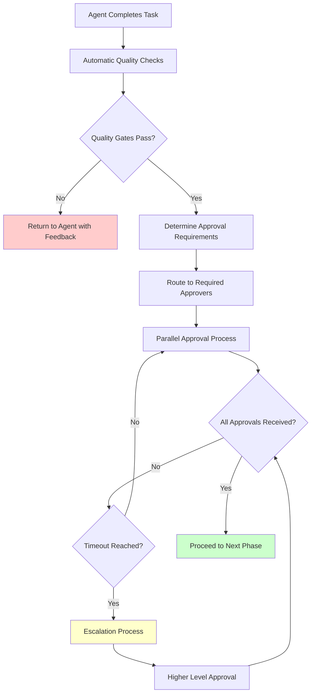

# Enterprise-Ready Responsible AI Governance & Compliance Framework

## Overview

The AI Software Development with Human Governance (Human Governed AI Development Playbook) framework implements a comprehensive governance model that balances AI automation with human oversight, ensuring quality, compliance, and business alignment throughout the software development lifecycle.

---

## Universal Configuration Template

### Complete Governance Configuration: `.sdc/config.yaml`

```yaml
# Human Governed AI Development Playbook Universal Configuration Template
project:
  name: "myapp"
  version: "1.0.0"
  organization: "myorg"
  team: "platform-team"
  criticality: "high"              # low, medium, high, critical
  compliance_requirements: ["gdpr", "sox", "hipaa"]
  
# =============================================================================
# GOVERNANCE CONFIGURATION
# =============================================================================
governance:
  # Human oversight model
  oversight_model: "hybrid"         # autonomous, hybrid, supervised
  
  # Approval matrix based on impact and criticality
  approval_matrix:
    # Business impact approvals
    business_impact:
      low:
        approvers: ["product_manager"]
        required_approvals: 1
        timeout: "24h"
      medium:
        approvers: ["product_manager", "business_owner"]
        required_approvals: 2
        timeout: "48h"
      high:
        approvers: ["product_manager", "business_owner", "executive_sponsor"]
        required_approvals: 2
        timeout: "72h"
      critical:
        approvers: ["product_manager", "business_owner", "executive_sponsor", "ceo"]
        required_approvals: 3
        timeout: "168h"
        
    # Technical architecture approvals  
    architecture_changes:
      minor:
        approvers: ["technical_lead"]
        required_approvals: 1
        timeout: "12h"
      major:
        approvers: ["technical_lead", "principal_architect"]
        required_approvals: 2
        timeout: "48h"
      breaking:
        approvers: ["technical_lead", "principal_architect", "cto"]
        required_approvals: 3
        timeout: "72h"
        
    # Security and compliance approvals
    security_changes:
      standard:
        approvers: ["security_engineer"]
        required_approvals: 1
        timeout: "24h"
      sensitive:
        approvers: ["security_engineer", "security_lead"]
        required_approvals: 2
        timeout: "48h"
      critical:
        approvers: ["security_engineer", "security_lead", "ciso"]
        required_approvals: 3
        timeout: "72h"
        
    # Financial and resource approvals
    cost_impact:
      low:         # < $1K
        approvers: ["product_manager"]
        required_approvals: 1
        timeout: "24h"
      medium:      # $1K - $10K
        approvers: ["product_manager", "finance_partner"]
        required_approvals: 2
        timeout: "48h"
      high:        # $10K - $100K
        approvers: ["product_manager", "finance_partner", "director"]
        required_approvals: 3
        timeout: "72h"
      critical:    # > $100K
        approvers: ["product_manager", "finance_partner", "director", "vp"]
        required_approvals: 4
        timeout: "168h"

  # Quality gates and checkpoints
  checkpoints:
    # Requirements phase
    after_requirements_analysis:
      enabled: true
      required_reviews: ["business_analyst", "product_manager"]
      quality_gates:
        - "requirements_completeness"
        - "business_value_validation"
        - "stakeholder_sign_off"
      exit_criteria:
        - "All requirements have acceptance criteria"
        - "Business ROI validated and documented"
        - "Technical feasibility confirmed"
        
    # Architecture and design phase  
    after_architecture_design:
      enabled: true
      required_reviews: ["principal_architect", "technical_lead", "security_architect"]
      quality_gates:
        - "architecture_review"
        - "security_architecture_review"
        - "scalability_assessment"
        - "technology_choice_validation"
      exit_criteria:
        - "Architecture decision records (ADRs) documented"
        - "Security requirements addressed"
        - "Performance targets defined"
        - "Integration points identified"
        
    # Implementation phase
    after_implementation:
      enabled: true
      required_reviews: ["tech_lead", "senior_developer"]
      quality_gates:
        - "code_quality_check"
        - "security_static_analysis"
        - "unit_test_coverage"
        - "integration_test_validation"
      exit_criteria:
        - "Code coverage >= 90%"
        - "No critical security vulnerabilities"
        - "All unit tests passing"
        - "Code review approved"
        
    # Testing phase
    after_testing:
      enabled: true
      required_reviews: ["qa_lead", "automation_engineer"]
      quality_gates:
        - "functional_test_completion"
        - "performance_test_validation" 
        - "security_test_completion"
        - "accessibility_compliance"
      exit_criteria:
        - "All test scenarios executed"
        - "Performance SLAs met"
        - "Security vulnerabilities resolved"
        - "Accessibility standards met"
        
    # Security review
    after_security_review:
      enabled: true
      required_reviews: ["security_engineer", "compliance_officer"]
      quality_gates:
        - "vulnerability_assessment"
        - "penetration_test_results"
        - "compliance_validation"
        - "data_privacy_assessment"
      exit_criteria:
        - "No high/critical vulnerabilities"
        - "Compliance requirements met"
        - "Data privacy impact assessed"
        - "Security monitoring configured"
        
    # Performance validation
    after_performance_validation:
      enabled: true
      required_reviews: ["performance_engineer", "site_reliability_engineer"]
      quality_gates:
        - "load_test_results"
        - "scalability_validation"
        - "resource_utilization_check"
        - "monitoring_setup"
      exit_criteria:
        - "Performance SLAs validated"
        - "Auto-scaling configured"
        - "Monitoring and alerting active"
        - "Disaster recovery tested"
        
    # Infrastructure changes
    before_infrastructure_changes:
      enabled: true
      required_reviews: ["devops_lead", "infrastructure_architect", "security_engineer"]
      quality_gates:
        - "infrastructure_security_review"
        - "cost_impact_analysis" 
        - "backup_strategy_validation"
        - "disaster_recovery_plan"
      exit_criteria:
        - "Infrastructure as code validated"
        - "Security policies applied"
        - "Cost optimization implemented"
        - "Backup/DR procedures tested"
        
    # Integration testing
    after_integration_testing:
      enabled: true
      required_reviews: ["integration_engineer", "api_specialist"]
      quality_gates:
        - "api_contract_validation"
        - "end_to_end_test_completion"
        - "data_flow_validation"
        - "error_handling_verification"
      exit_criteria:
        - "All integrations tested"
        - "API contracts validated"
        - "Error scenarios handled"
        - "Data consistency verified"
        
    # Pre-production deployment
    before_production_deployment:
      enabled: true
      required_reviews: ["release_manager", "production_support", "business_owner"]
      quality_gates:
        - "production_readiness_review"
        - "rollback_plan_validation"
        - "monitoring_configuration"
        - "support_documentation"
      exit_criteria:
        - "Production environment validated"
        - "Rollback procedures tested"
        - "Support documentation complete"
        - "Go-live checklist completed"
        
    # Post-deployment validation
    after_production_deployment:
      enabled: true
      required_reviews: ["sre_engineer", "product_manager"]
      quality_gates:
        - "health_check_validation"
        - "performance_monitoring"
        - "error_rate_monitoring"
        - "user_impact_assessment"
      exit_criteria:
        - "All health checks passing"
        - "Performance within SLAs"
        - "No critical errors"
        - "User feedback positive"

  # Escalation procedures
  escalation:
    levels:
      level_1:
        trigger: "checkpoint_failure"
        contacts: ["tech_lead", "product_manager"]
        response_time: "2h"
        
      level_2:
        trigger: "repeated_failures"
        contacts: ["engineering_manager", "product_director"]
        response_time: "4h"
        
      level_3:
        trigger: "critical_issue"
        contacts: ["vp_engineering", "vp_product"]
        response_time: "1h"
        
      level_4:
        trigger: "business_critical"
        contacts: ["cto", "cpo", "ceo"]
        response_time: "30min"
        
    procedures:
      automatic_escalation: true
      escalation_timeout: "24h"
      notification_channels: ["slack", "email", "pagerduty"]
      
# =============================================================================
# AGENT CONFIGURATION  
# =============================================================================
agents:
  # Agent execution settings
  execution:
    max_concurrent_agents: 3
    agent_timeout: "30min"
    retry_attempts: 3
    failure_handling: "escalate"
    
  # Agent communication protocol
  communication:
    message_format: "json"
    response_format: "structured"
    handoff_validation: true
    context_preservation: true
    
  # Agent quality controls
  quality_controls:
    output_validation: true
    consistency_checks: true
    security_scanning: true
    performance_monitoring: true
    
# =============================================================================
# COMPLIANCE CONFIGURATION
# =============================================================================
compliance:
  frameworks:
    gdpr:
      enabled: true
      data_residency: "eu"
      privacy_impact_assessment: true
      consent_management: true
      right_to_be_forgotten: true
      
    sox:
      enabled: false
      financial_controls: true
      audit_trail: true
      segregation_of_duties: true
      
    hipaa:
      enabled: false
      phi_protection: true
      access_controls: true
      audit_logging: true
      encryption_requirements: true
      
    pci_dss:
      enabled: false
      cardholder_data_protection: true
      secure_transmission: true
      vulnerability_management: true
      
  audit:
    trail_retention: "7_years"
    log_encryption: true
    tamper_protection: true
    real_time_monitoring: true
    
# =============================================================================
# SECURITY CONFIGURATION
# =============================================================================
security:
  code_scanning:
    static_analysis: true
    dynamic_analysis: true
    dependency_scanning: true
    secret_detection: true
    
  infrastructure_security:
    network_segmentation: true
    encryption_at_rest: true
    encryption_in_transit: true
    access_controls: true
    
  monitoring:
    security_information_event_management: true
    threat_detection: true
    incident_response: true
    forensic_capabilities: true
    
# =============================================================================
# PERFORMANCE CONFIGURATION  
# =============================================================================
performance:
  targets:
    response_time_p95: "200ms"
    availability: "99.9%"
    error_rate: "0.1%"
    throughput: "1000rps"
    
  monitoring:
    real_user_monitoring: true
    synthetic_monitoring: true
    application_performance_monitoring: true
    infrastructure_monitoring: true
    
  optimization:
    auto_scaling: true
    load_balancing: true
    caching: true
    cdn: true
    
# =============================================================================
# COST MANAGEMENT CONFIGURATION
# =============================================================================
cost_management:
  budgets:
    development: "$10000/month"
    staging: "$2000/month" 
    production: "$50000/month"
    
  optimization:
    resource_rightsizing: true
    spot_instances: true
    scheduled_scaling: true
    cost_alerting: true
    
  tracking:
    cost_allocation_tags: true
    department_chargeback: true
    project_cost_tracking: true
    roi_measurement: true
    
# =============================================================================
# INTEGRATION CONFIGURATION
# =============================================================================
integrations:
  version_control:
    provider: "github"
    branch_protection: true
    required_reviews: 2
    status_checks: true
    
  ci_cd:
    provider: "github_actions"
    automated_testing: true
    security_scanning: true
    deployment_gates: true
    
  monitoring:
    metrics: "prometheus"
    logging: "elasticsearch"
    tracing: "jaeger"
    alerting: "alertmanager"
    
  notification:
    slack_webhook: "$SLACK_WEBHOOK_URL"
    email_smtp: "$EMAIL_SMTP_CONFIG"
    pagerduty_key: "$PAGERDUTY_INTEGRATION_KEY"
    
# =============================================================================
# REPORTING CONFIGURATION
# =============================================================================
reporting:
  dashboards:
    governance_metrics: true
    quality_metrics: true
    performance_metrics: true
    cost_metrics: true
    
  automated_reports:
    daily_summary: true
    weekly_detailed: true
    monthly_executive: true
    quarterly_review: true
    
  kpis:
    - name: "Deployment Frequency"
      target: "Daily"
      measurement: "Deployments per day"
      
    - name: "Lead Time"
      target: "< 2 hours"
      measurement: "Commit to production time"
      
    - name: "Mean Time to Recovery"
      target: "< 1 hour"
      measurement: "Incident resolution time"
      
    - name: "Change Failure Rate"
      target: "< 5%"
      measurement: "Failed deployments percentage"
      
    - name: "Code Quality Score"
      target: "> 8.5/10"
      measurement: "SonarQube quality gate score"
      
    - name: "Security Vulnerabilities"
      target: "0 Critical, < 5 High"
      measurement: "Open security issues"
      
    - name: "Test Coverage"
      target: "> 90%"
      measurement: "Unit test code coverage"
      
    - name: "Customer Satisfaction"
      target: "> 4.5/5"
      measurement: "User feedback score"
```

---

## Governance Implementation Guide

### 1. Checkpoint Implementation

Each checkpoint in the governance framework follows a standardized process:

```typescript
interface GovernanceCheckpoint {
  id: string;
  name: string;
  phase: Human Governed AI Development PlaybookPhase;
  trigger: CheckpointTrigger;
  required_reviews: string[];
  quality_gates: QualityGate[];
  exit_criteria: ExitCriterion[];
  approval_matrix: ApprovalRequirement[];
  escalation_rules: EscalationRule[];
}

interface QualityGate {
  id: string;
  name: string;
  type: "automated" | "manual" | "hybrid";
  criteria: string[];
  tools: string[];
  pass_threshold: number;
  mandatory: boolean;
}

interface ApprovalRequirement {
  role: string;
  required: boolean;
  timeout: string;
  escalation_path: string[];
}
```

### 2. Human Approval Workflow



### 3. Risk-Based Governance

The framework implements risk-based governance where oversight intensity scales with project risk:

```yaml
risk_assessment:
  factors:
    business_impact:
      weights:
        revenue_impact: 0.3
        customer_impact: 0.25
        regulatory_impact: 0.25
        operational_impact: 0.2
        
    technical_complexity:
      weights:
        architecture_changes: 0.4
        integration_complexity: 0.3
        technology_novelty: 0.2
        team_experience: 0.1
        
    security_sensitivity:
      weights:
        data_classification: 0.4
        access_scope: 0.3
        external_exposure: 0.2
        compliance_requirements: 0.1
        
  governance_scaling:
    low_risk:
      automation_level: "high"
      human_oversight: "minimal"
      approval_speed: "fast"
      
    medium_risk:
      automation_level: "medium"
      human_oversight: "standard"
      approval_speed: "normal"
      
    high_risk:
      automation_level: "low"
      human_oversight: "intensive"
      approval_speed: "thorough"
      
    critical_risk:
      automation_level: "minimal"
      human_oversight: "continuous"
      approval_speed: "comprehensive"
```

---

## Role-Based Access Control

### 1. Governance Roles and Responsibilities

```yaml
governance_roles:
  product_manager:
    responsibilities:
      - "Business requirement validation"
      - "Feature prioritization"
      - "ROI assessment"
      - "Go-to-market approval"
    permissions:
      - "approve_business_changes"
      - "reject_low_business_value"
      - "escalate_to_business_owner"
    checkpoints:
      - "after_requirements_analysis"
      - "before_production_deployment"
      
  technical_lead:
    responsibilities:
      - "Technical architecture decisions"
      - "Code quality validation"
      - "Technology choice approval"
      - "Technical risk assessment"
    permissions:
      - "approve_technical_changes"
      - "reject_poor_code_quality"
      - "escalate_to_architect"
    checkpoints:
      - "after_architecture_design"
      - "after_implementation"
      
  security_engineer:
    responsibilities:
      - "Security requirement validation"
      - "Vulnerability assessment"
      - "Compliance verification"
      - "Security incident response"
    permissions:
      - "approve_security_changes"
      - "reject_security_violations"
      - "escalate_to_security_lead"
    checkpoints:
      - "after_security_review"
      - "before_production_deployment"
      
  qa_lead:
    responsibilities:
      - "Test strategy validation"
      - "Quality assurance oversight"
      - "Test automation approval"
      - "Release quality validation"
    permissions:
      - "approve_test_completion"
      - "reject_insufficient_testing"
      - "escalate_to_qa_manager"
    checkpoints:
      - "after_testing"
      - "after_integration_testing"
```

### 2. Dynamic Approval Matrix

The approval matrix adapts based on change characteristics:

```typescript
class DynamicApprovalMatrix {
  static determineApprovers(change: ChangeRequest): ApprovalRequirement[] {
    const approvers: ApprovalRequirement[] = [];
    
    // Business impact assessment
    if (change.businessImpact >= 'medium') {
      approvers.push({
        role: 'product_manager',
        required: true,
        timeout: '48h'
      });
    }
    
    if (change.businessImpact >= 'high') {
      approvers.push({
        role: 'business_owner',
        required: true,
        timeout: '72h'
      });
    }
    
    // Technical complexity assessment
    if (change.architectureChanges || change.technicalComplexity >= 'medium') {
      approvers.push({
        role: 'technical_lead',
        required: true,
        timeout: '24h'
      });
    }
    
    if (change.architectureChanges === 'breaking') {
      approvers.push({
        role: 'principal_architect',
        required: true,
        timeout: '48h'
      });
    }
    
    // Security impact assessment
    if (change.securityImpact >= 'low') {
      approvers.push({
        role: 'security_engineer',
        required: true,
        timeout: '24h'
      });
    }
    
    // Compliance requirements
    if (change.complianceImpact.length > 0) {
      approvers.push({
        role: 'compliance_officer',
        required: true,
        timeout: '48h'
      });
    }
    
    return approvers;
  }
}
```

---

## Metrics and KPIs

### 1. Governance Effectiveness Metrics

```typescript
interface GovernanceMetrics {
  efficiency: {
    averageApprovalTime: number;
    checkpointPassRate: number;
    escalationRate: number;
    automationLevel: number;
  };
  
  quality: {
    defectEscapeRate: number;
    securityVulnerabilities: number;
    complianceViolations: number;
    customerSatisfaction: number;
  };
  
  velocity: {
    deploymentFrequency: number;
    leadTime: number;
    meanTimeToRecovery: number;
    changeFailureRate: number;
  };
  
  cost: {
    governanceOverhead: number;
    reworkCost: number;
    complianceCost: number;
    totalCostOfOwnership: number;
  };
}
```

### 2. Real-time Governance Dashboard

```yaml
governance_dashboard:
  real_time_metrics:
    - pending_approvals
    - checkpoint_status
    - quality_gate_results
    - escalated_items
    - sla_violations
    
  trend_analysis:
    - approval_time_trends
    - quality_improvement
    - velocity_metrics
    - cost_optimization
    
  predictive_analytics:
    - risk_forecasting
    - capacity_planning
    - quality_prediction
    - cost_projection
    
  alerts:
    - governance_violations
    - sla_breaches
    - quality_degradation
    - security_incidents
```

---

## Integration with Development Tools

### 1. Git Integration

```yaml
git_integration:
  branch_protection:
    main:
      required_reviews: 2
      required_status_checks:
        - "governance/checkpoint-validation"
        - "quality/security-scan"
        - "quality/test-coverage"
      restrictions:
        - "governance-bypass-disabled"
        
  automated_checks:
    pre_commit:
      - "code_quality_scan"
      - "security_secret_detection"
      - "compliance_validation"
      
    pre_push:
      - "unit_test_execution"
      - "integration_test_validation"
      - "performance_regression_check"
      
  governance_hooks:
    checkpoint_validation:
      trigger: "pull_request"
      validation: "governance_compliance"
      blocking: true
```

### 2. CI/CD Integration

```yaml
cicd_governance:
  pipeline_gates:
    build:
      quality_gates:
        - "code_coverage_threshold"
        - "security_vulnerability_scan"
        - "dependency_vulnerability_check"
      approvals:
        - "automated_quality_check"
        
    test:
      quality_gates:
        - "functional_test_completion"
        - "performance_test_validation"
        - "security_test_execution"
      approvals:
        - "qa_lead_approval"
        
    deploy_staging:
      quality_gates:
        - "infrastructure_validation"
        - "security_configuration_check"
        - "monitoring_setup_validation"
      approvals:
        - "devops_lead_approval"
        
    deploy_production:
      quality_gates:
        - "business_validation"
        - "security_final_check"
        - "rollback_plan_validation"
      approvals:
        - "product_manager_approval"
        - "technical_lead_approval"
        - "security_engineer_approval"
```

---

## Compliance Automation

### 1. Automated Compliance Checks

```typescript
class ComplianceAutomation {
  static async validateGDPRCompliance(codebase: Codebase): Promise<ComplianceResult> {
    const checks = [
      this.checkDataProcessingConsent(codebase),
      this.validateDataRetentionPolicies(codebase),
      this.verifyRightToBeForgotten(codebase),
      this.auditDataTransfers(codebase)
    ];
    
    const results = await Promise.all(checks);
    
    return {
      compliant: results.every(r => r.passed),
      violations: results.filter(r => !r.passed),
      recommendations: this.generateRecommendations(results)
    };
  }
  
  static async validateSOXCompliance(changes: ChangeRequest[]): Promise<ComplianceResult> {
    return {
      financialControlsValidated: await this.validateFinancialControls(changes),
      auditTrailComplete: await this.validateAuditTrail(changes),
      segregationOfDutiesEnforced: await this.validateSegregationOfDuties(changes),
      changeControlsFollowed: await this.validateChangeControls(changes)
    };
  }
}
```

---

## Human Collaboration Guidelines

### 1. Governance Best Practices

- **Clear accountability**: Each checkpoint has defined responsible parties
- **Balanced automation**: Automate routine checks, human oversight for complex decisions
- **Risk-proportionate**: Governance intensity matches risk level
- **Continuous improvement**: Regular review and optimization of governance processes

### 2. Communication Protocols

- **Transparent decision-making**: All governance decisions are documented and traceable
- **Timely notifications**: Stakeholders are notified promptly of required actions
- **Escalation clarity**: Clear escalation paths for governance issues
- **Feedback loops**: Continuous feedback to improve governance effectiveness

---

 

The Human Governed AI Development Playbook Governance Framework provides a comprehensive, risk-based approach to software development governance that balances AI automation with human oversight. It ensures quality, security, compliance, and business alignment while maintaining development velocity and team productivity.

The framework is designed to be universally applicable across technologies, scalable across team sizes, and adaptable to various organizational contexts and compliance requirements.